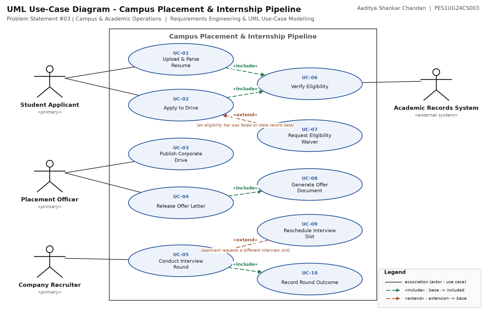

# Lab 1 — Requirements Engineering & UML Use-Case Modelling

**Aaditya Shankar Chandan** · **PES1UG24CS003**  
Software Engineering - Lab 1 — Requirements Engineering & UML Use-Case Modelling  
Problem Statement #03 | Campus & Academic Operations

## Scenario

> **Campus Placement & Internship Pipeline**  
> The campus placement cell manages hundreds of corporate drives with varying eligibility criteria. The platform must parse student resumes, apply multi-tier CGPA and backlog filters, manage multi-round interview queues, and process offer letters.

## Deliverables

| # | Deliverable | Files |
|---|---|---|
| 1 | Requirements Table — 5 FRs + 2 NFRs with ID, Type, Description, Priority, Acceptance Criteria, Rationale, Comments | [`.docx`](docs/01_Requirements_Table.docx) · [`.xlsx`](docs/01_Requirements_Table.xlsx) · [`.pdf`](docs/01_Requirements_Table.pdf) |
| 2 | UML Use-Case Diagram — 4 actors, 10 use cases, 4 `«include»` + 2 `«extend»` | [`.pdf`](docs/02_UseCase_Diagram.pdf) · [`.png`](docs/02_UseCase_Diagram.png) · [editable `.drawio`](diagram/placement_pipeline_usecase.drawio) |
| 3 | Use-Case Flow — UC-02 Apply to Drive, preconditions, postconditions, main success scenario, 2 alternate flows | [`.docx`](docs/03_UseCase_Flow_UC-02.docx) · [`.pdf`](docs/03_UseCase_Flow_UC-02.pdf) |

---

## 1. Requirements Table

| Req ID | Type | Priority | Description ("The system shall …") |
|---|---|---|---|
| **FR-001** | Functional | High | The system shall parse an uploaded student resume (PDF, up to 5 MB), extract skill tags onto the student profile, and evaluate the profile against the eligibility rule set of every active drive, recording a per-tier verdict with a discrepancy reason. |
| **FR-002** | Functional | High | The system shall allow a Placement Officer to publish a corporate drive specifying an application window, a round structure, and a multi-tier eligibility rule set covering minimum CGPA, maximum active backlogs, permitted branches and a prior-offer cap. |
| **FR-003** | Functional | High | The system shall allow a Student Applicant to apply to any drive for which they are marked Eligible at any time before the application window closes, and shall refuse the application once the window has closed or the student's prior-offer cap is reached. |
| **FR-004** | Functional | High | The system shall allow a Company Recruiter to mark every applicant in a closing interview round as Advanced, Rejected or On Hold, and shall place advanced applicants in the queue for the next round while preserving each applicant's round history. |
| **FR-005** | Functional | High | The system shall allow a Placement Officer to release an offer letter to a selected applicant recording company, role, CTC and acceptance deadline, and shall increment the student's accepted-offer count when the student accepts. |
| **NFR-001** | Nonfunctional - Performance & Security | High | The system shall store all student academic records and offer documents encrypted at rest with AES-256, and shall serve an authenticated document download in under 3 seconds while the platform is under peak drive-season load. |
| **NFR-002** | Nonfunctional - Auditability | High | The system shall write every eligibility verdict, round outcome and offer release to an append-only audit log capturing the actor, the rule or decision applied and a UTC timestamp, retain entries for 3 years, and expose no interface that edits or deletes them. |

<details>
<summary><b>Acceptance criteria, rationale and peer-critique comments (click to expand)</b></summary>

#### FR-001 — Functional _(given with the problem statement)_

**Description.** The system shall parse an uploaded student resume (PDF, up to 5 MB), extract skill tags onto the student profile, and evaluate the profile against the eligibility rule set of every active drive, recording a per-tier verdict with a discrepancy reason.

**Acceptance criteria.** PASS: for a student holding an active backlog, every drive requiring zero backlogs is marked Ineligible with reason ACTIVE_BACKLOG, and the extracted skill tags appear on the profile within 30 seconds of upload. FAIL: a student with an active backlog is shown as Eligible for a zero-backlog drive, or a resume is accepted with no skill tags extracted.

**Rationale.** Eligibility screening is the gate for every later stage of the pipeline; an applicant who slips past a backlog rule consumes a recruiter's interview slot and costs the cell credibility with the company.

**Peer critique → revision.** Peer: "Does 'filtered out' mean the drive disappears?" -> reworded: ineligible drives stay visible with the failing tier named, so a student can contest a stale record. (Given requirement, refined.)

#### FR-002 — Functional

**Description.** The system shall allow a Placement Officer to publish a corporate drive specifying an application window, a round structure, and a multi-tier eligibility rule set covering minimum CGPA, maximum active backlogs, permitted branches and a prior-offer cap.

**Acceptance criteria.** PASS: a published drive refuses an application from a student who violates any single tier, and the refusal names the tier violated. FAIL: a drive can be published with no CGPA tier and no backlog tier set, or a student violating one tier can still apply.

**Rationale.** Every company sets its own thresholds; encoding them once at publish time is what makes the automated screening in FR-001 possible instead of a manual spreadsheet pass.

**Peer critique → revision.** Peer: "What about a company with no branch restriction?" -> the branch list defaults to 'all programmes' rather than being a mandatory field.

#### FR-003 — Functional

**Description.** The system shall allow a Student Applicant to apply to any drive for which they are marked Eligible at any time before the application window closes, and shall refuse the application once the window has closed or the student's prior-offer cap is reached.

**Acceptance criteria.** PASS: an application submitted 1 minute before the window closes is accepted and appears in the recruiter's applicant list; one submitted 1 minute after is refused with reason WINDOW_CLOSED, and a student already at the cap is refused with reason OFFER_CAP_REACHED. FAIL: a late application is accepted, or an eligible in-window application is refused.

**Rationale.** The application window is contractual with the visiting company; accepting a late application forces the cell to reconcile the shortlist by hand after it has been sent.

**Peer critique → revision.** Peer: "Two different refusals are bundled into one requirement." -> kept as one requirement because both are window/quota gates on the same action, but each now has its own reason code in the criteria.

#### FR-004 — Functional

**Description.** The system shall allow a Company Recruiter to mark every applicant in a closing interview round as Advanced, Rejected or On Hold, and shall place advanced applicants in the queue for the next round while preserving each applicant's round history.

**Acceptance criteria.** PASS: once round N is closed every applicant carries exactly one outcome, advanced applicants appear in round N+1's queue, and rejected applicants appear in no later queue. FAIL: an applicant appears in two round queues at once, a rejected applicant reaches round N+1, or a round closes with an applicant left unmarked.

**Rationale.** A drive runs three to five rounds across several days; without one authoritative queue the cell reconciles rounds over email and students receive contradictory call letters.

**Peer critique → revision.** Peer: "'On Hold' is ambiguous - held until when?" -> On Hold applicants stay in round N's pool and may be advanced until the drive is closed, then lapse to Rejected.

#### FR-005 — Functional

**Description.** The system shall allow a Placement Officer to release an offer letter to a selected applicant recording company, role, CTC and acceptance deadline, and shall increment the student's accepted-offer count when the student accepts.

**Acceptance criteria.** PASS: on release the student is notified and the letter is downloadable; on acceptance the offer count increments and every drive above the student's prior-offer cap turns Ineligible. FAIL: an offer is released with no acceptance deadline, or an accepted offer leaves the student's eligibility for further drives unchanged.

**Rationale.** The offer is the terminal event of the pipeline and the input to the one-offer policy that FR-003 enforces, so it must feed straight back into eligibility.

**Peer critique → revision.** Peer: "Who is allowed to see the CTC?" -> visibility limited to the student and the placement cell; the confidentiality obligation is carried by NFR-001.

#### NFR-001 — Nonfunctional - Performance & Security _(given with the problem statement)_

**Description.** The system shall store all student academic records and offer documents encrypted at rest with AES-256, and shall serve an authenticated document download in under 3 seconds while the platform is under peak drive-season load.

**Acceptance criteria.** PASS: a raw read of the database files and object store yields no plaintext CGPA, resume text or offer content, and under a simulated peak of 500 concurrent users 95% of authenticated downloads complete in under 3 s. FAIL: any plaintext record is recoverable from the storage media, or the 95th-percentile download exceeds 3 s.

**Rationale.** Academic records and offer terms are personal data the university is accountable for, and drive season concentrates nearly all traffic into a few days, so the encryption must not be paid for in latency.

**Peer critique → revision.** Peer: "The given criterion only says 'benchmarking tests confirm' - confirm what number?" -> pinned to 500 concurrent users and a 3 s 95th-percentile target. (Given requirement, refined.)

#### NFR-002 — Nonfunctional - Auditability

**Description.** The system shall write every eligibility verdict, round outcome and offer release to an append-only audit log capturing the actor, the rule or decision applied and a UTC timestamp, retain entries for 3 years, and expose no interface that edits or deletes them.

**Acceptance criteria.** PASS: for any applicant the full chain from resume upload to final outcome can be reconstructed from the log alone, and an attempt to modify or delete an entry through the application returns HTTP 403 and is itself logged. FAIL: any decision has no log entry, or an existing entry can be altered through the application.

**Rationale.** Placement outcomes are routinely contested by students and by companies; without an immutable trail the cell cannot show that a multi-tier rule was applied consistently across hundreds of drives.

**Peer critique → revision.** Peer: "Where does 3 years come from?" -> matched to the university's grievance-redressal window for a graduating batch.

</details>

> FR-001 and NFR-001 are the requirements supplied with the problem statement. FR-002–FR-005 and NFR-002 are student-authored. The *Comments* column records the peer-critique round (Lab step 3) and the revision each comment produced.

---

## 2. UML Use-Case Diagram



Submit [`docs/02_UseCase_Diagram.pdf`](docs/02_UseCase_Diagram.pdf). To edit, open [`diagram/placement_pipeline_usecase.drawio`](diagram/placement_pipeline_usecase.drawio) at [app.diagrams.net](https://app.diagrams.net) via **File → Open From → Device**.

### Actors

| Actor | Classification | Goal in the system |
|---|---|---|
| **Student Applicant** | Primary | Uploads a resume, applies to eligible drives, attends rounds and responds to offers. |
| **Placement Officer** | Primary | Publishes drives with their eligibility rule sets and releases offer letters. |
| **Company Recruiter** | Primary (external organisation) | Reviews the applicant queue and records the outcome of each interview round. |
| **Academic Records System** | Secondary (external system) | Supplies the authoritative CGPA and active-backlog figures used for eligibility checks. |

### Use cases

| UC ID | Use Case | Actor / relationship | Traces to |
|---|---|---|---|
| **UC-01** | Upload & Parse Resume | Student Applicant | FR-001, NFR-001 |
| **UC-02** | Apply to Drive | Student Applicant | FR-003 |
| **UC-03** | Publish Corporate Drive | Placement Officer | FR-002 |
| **UC-04** | Release Offer Letter | Placement Officer | FR-005 |
| **UC-05** | Conduct Interview Round | Company Recruiter | FR-004 |
| **UC-06** | Verify Eligibility | Academic Records System; (included by UC-01, UC-02) | FR-001, FR-002, NFR-002 |
| **UC-07** | Request Eligibility Waiver | (extends UC-02) | FR-001, FR-003 |
| **UC-08** | Generate Offer Document | (included by UC-04) | FR-005, NFR-001 |
| **UC-09** | Reschedule Interview Slot | (extends UC-05) | FR-004 |
| **UC-10** | Record Round Outcome | (included by UC-05) | FR-004, NFR-002 |

### `«include»` and `«extend»` relationships

| Stereotype | From | To | Why |
|---|---|---|---|
| `«include»` | UC-01 | UC-06 | parsing a resume always screens it against every active drive |
| `«include»` | UC-02 | UC-06 | every application is re-screened against that drive's rule set |
| `«include»` | UC-04 | UC-08 | releasing an offer always generates the offer document |
| `«include»` | UC-05 | UC-10 | closing a round always records an outcome for every applicant |
| `«extend»` | UC-07 | UC-02 | condition: an eligibility tier was failed on stale record data |
| `«extend»` | UC-09 | UC-05 | condition: applicant requests a different interview slot |

*Reading the arrows:* an `«include»` arrow points **from the base use case to the included one** (the included behaviour always runs); an `«extend»` arrow points **from the extending use case back to the base** (the behaviour runs only when its condition holds).

---

## 3. Use-Case Flow — UC-02 Apply to Drive

- **Primary Actor:** Student Applicant
- **Secondary Actor:** Academic Records System (supporting)
- **Scope & Level:** Campus Placement & Internship Pipeline (portal) - user-goal level
- **Trigger:** Student Applicant opens an open drive from the Drives list and selects Apply.
- **Traces to:** FR-001, FR-002, FR-003, NFR-002
- **Relationships:** «include» UC-06 Verify Eligibility; extended by «extend» UC-07 Request Eligibility Waiver

**Preconditions**

1. The Student Applicant is authenticated and has a parsed resume on their profile (UC-01 completed).
2. The drive is published and its application window is currently open.
3. The Academic Records System is reachable and holds the student's CGPA and active-backlog figures for the current semester.
4. The student's accepted-offer count is below the drive's prior-offer cap.

**Postconditions**

1. An application record linking the student to the drive is persisted with status Submitted and a UTC timestamp.
2. The student appears exactly once in the drive's applicant list shown to the Company Recruiter.
3. An append-only audit entry records the per-tier eligibility verdict and the actor who submitted the application (NFR-002).
4. A confirmation showing the drive, its round schedule and the window close time is sent to the student.
5. Failure guarantee: on any error no application record is created, the drive's applicant count is unchanged, and the attempt is still logged with its refusal reason.

**Main Success Scenario**

1. Student Applicant opens the Drives list and selects an open drive.
2. System displays the drive's role, CTC band, round structure, eligibility rule set and the time remaining in the application window.
3. Student Applicant selects "Apply".
4. System performs «include» UC-06 Verify Eligibility: it fetches the current CGPA and active-backlog count from the Academic Records System and evaluates every tier of the rule set - minimum CGPA, maximum backlogs, permitted branches and prior-offer cap.
5. System confirms that every tier passes and shows the eligibility summary alongside the skill tags matched from the parsed resume (FR-001).
6. Student Applicant confirms which resume version to attach and submits the application.
7. System re-checks that the application window is still open at the instant of submission.
8. System persists the application with status Submitted, adds the student to the drive's applicant list, and writes the audit entry.
9. System displays a confirmation with the round schedule and updates the Placement Officer's dashboard with the new applicant count.
10. Use case ends successfully.

**Alternate Flows**

*5a. One or more eligibility tiers fail  (extension point: eligibility rejected -> «extend» UC-07 Request Eligibility Waiver)*

- 5a1. UC-06 returns at least one failed tier, for example ACTIVE_BACKLOG or CGPA_BELOW_MINIMUM.
- 5a2. System marks the drive Ineligible and lists each failed tier with the value held on record beside the value required; the drive is not hidden.
- 5a3. If the student believes the academic record is stale they select "Request waiver / re-check", which starts UC-07 and routes the discrepancy to the Placement Officer.
- 5a4. If the officer approves the waiver the flow resumes at step 6; otherwise the use case ends with no application created.

*7a. Application window closes during the session*

- 7a1. The window close time passes between step 3 and step 7.
- 7a2. System refuses the submission with reason WINDOW_CLOSED and shows the exact close timestamp.
- 7a3. System offers the list of drives that are still open to the student.
- 7a4. Use case ends with no application record created.

**Exception Flow**

- 4a. Academic Records System unreachable - the system does not fall back to a cached CGPA. The application is held as Pending Verification for up to 2 hours and retried; if verification still fails the student is notified to retry before the window closes, and the failed attempt is logged.

---

## Repository layout

```
docs/     final deliverables (submit these)
diagram/  editable draw.io source for the use-case diagram
build/    scripts that generate everything in docs/ from content.py
```

## Regenerating the deliverables

`build/content.py` is the single source of truth — every table, diagram label and flow step is written once there. Edit it, then:

```bash
pip install python-docx openpyxl reportlab matplotlib
cd build
python build_diagram.py   # docs/02_UseCase_Diagram.pdf + .png, diagram/*.drawio
python build_docs.py      # docs/01_*.docx/.xlsx/.pdf, docs/03_*.docx/.pdf
python build_readme.py    # this README
```
